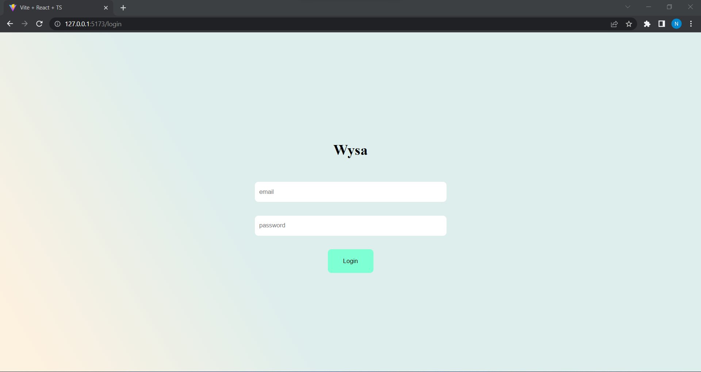
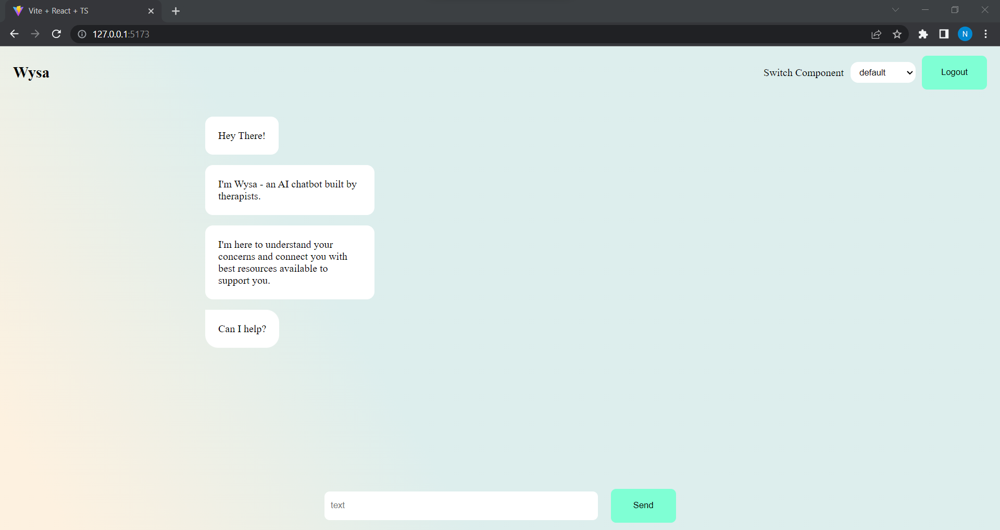
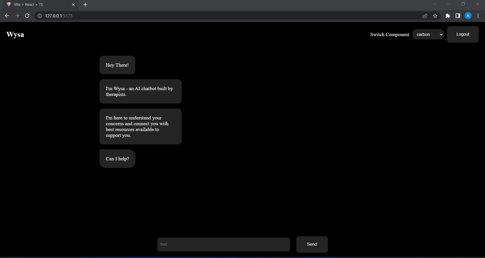
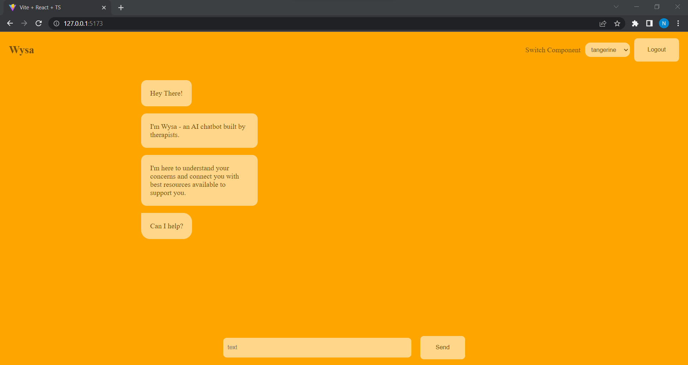
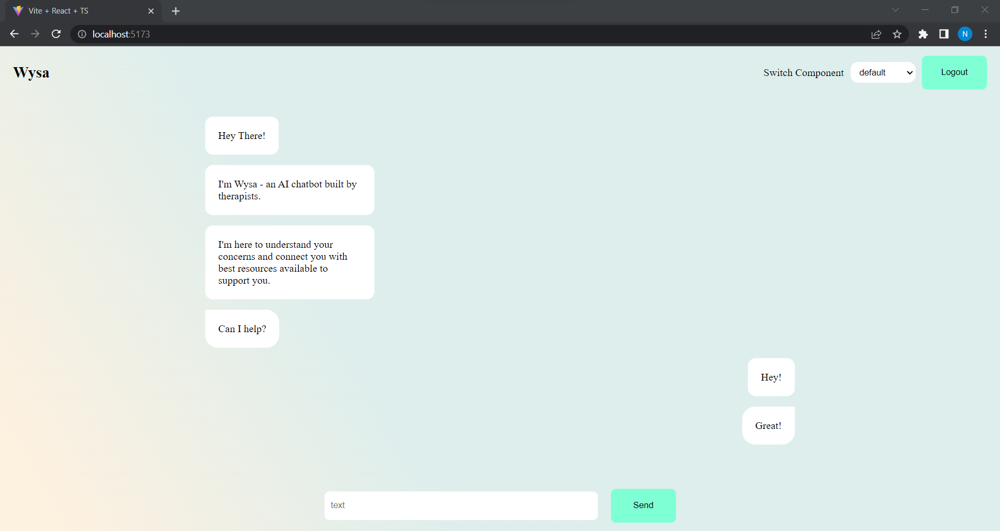

# WYSA HIRING CHALLENGE

## Login Creds

```
email: root
password: root

```

## Backend Setup

Note: change directory to 'Backend'

```

1. npm install

2. npm run start

```

### Backend server running on port: 3002

## Frontend Setup

Note: change directory to 'frontend-wysa'

```
1. npm install

2. npm run dev

```

### Frontend server running on port: 5173
### Go to [localhost:5173](http://localhost:5173/)

## Screenshots











## Features

- Typescript
- Refactored Code
- React Context API
- Persistant State using LocalStrage


## Thanks!!
